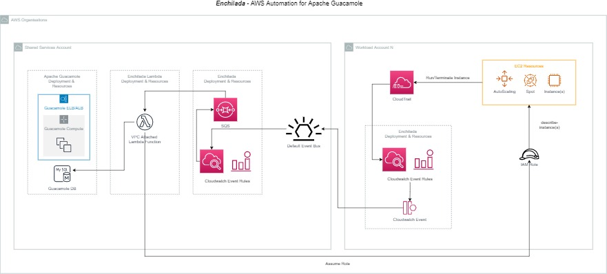

# Introduction

The following blog post details a solution that we have delivered into some of our customers AWS organisations to provide a centralised bastion solution for their multi-account environments that provides the utmost level of security and traceability for their compliance teams.

I'm writing about it here because I think that it is a great pattern that demonstrates the power of AWS Events and serverless functions and how they can be leveraged to enhance and integrate existing software solutions that arent entirely cloud native nicely into a cloud environment.

This pattern was initially architected and developed by my collegues Yuri Litvinov and Richard Nguyen, and I'm representing their work here as it's a pattern I regularly use for education and AWS Partner competency purposes. So in the case of this post, I am standing on the shoulders of giants.

One final note is that this post represents an older topology of the solution, and we have uplifted the pattern to now leverage Guacamole API's rather than working with the database directly, as well as enhancements in the event space to leverage newer capabilities where available.


# Problem Statement

Within the clients AWS environment, there is a requirement that all Windows and Linux EC2 instances must be accessed via a centralised, remote access bastion solution in the shared services account and associated networks. As part of this solution, the bastion solution must have the following capabilities

| Capability       | Description      | 
| ------------- | ------------- | 
| AUDIT LOGS         | Every connection is logged to CloudWatch and/or CloudTrail for traceability and audit needs.  | 
| SESSION RECORDING  | There must be the ability to go back in time and audit the users bastion sessions to EC2 instances  | 
| SINGLE SIGN-ON AND MFA        | The solution must support Single Sign-On and Multi-Factor Authentication  for a seamless and secure user experience.  | 
| AUTO DISCOVERY        | The solution must automatically discover and configure new EC2 instances in the bastion interface so they can easily be connected to by end users. In addition to this, terminated instances must also be removed from the bastion interface ensuring that the user experience is pleasant | 
| CLIENTLESS SOLUTION         | Use of the solution should be done through an Easy-to-use web interface without the need for plugins |

# Proposed Solution

We initially investigated the use of entirely cloud native AWS services to solve this problem, specifically leveraging AWS Systems Manager Session Manager, however its current capabilities were unable to provide solutions for all the clients requirements.

As a result, we designed and delivered a solution that leveraged Apache Guacamole in conjunction with automation that uses AWS native services, we call this solution “Enchilada”.

The core components are: 

* Apache Guacamole

    Deployed using EC2, RDS, ELB, VPC as well as integration into the customers AWS Managed Active Directory Service for identity.
    Apache Guacamole is a clientless remote desktop gateway. It supports standard protocols like VNC, RDP, and SSH.
    Using to HTML5, once Guacamole is installed on a server, all you need to access your systems is a web browser, and it provides integration to common single sign on systems including Active Directory, while providing additional security capabilities through the introduction of MFA.

    To provide high quality compliance data, the EC2 Instances were configured with regular cronjobs that would copy the recorded session data from the EC2 Instances to an S3 bucket in a dedicated Compliance account using the AWS CLI where they could not be tampered with.

    The network was configured so that all EC2 Instances in the environment could only receive SSH/RDP Traffic from the Bastions networks to enforce the use of this solution in the environment.


* Enchilada Instance Auto Discovery automation

    This automation functions by leveraging Cloudwatch Events that are associated with EC2 Instances Launching and Terminating in multiple AWS Accounts within an AWS Organisation. When these events occur, they are passed through to a centralised Lambda function that connects to the Apache Guacamole database and updates its configuration to add or remove the corresponding instance(s) from it’s configuration.

    To ensure that the EC2 instances that are populated automatically inside the Guacamole database are configured correctly, the Lambda assumes a role into each of the AWS accounts that the EC2 instance resides in and fetches its name, DNS Name, IP address and other metadata for use.

    As a result, When EC2 Instances are launched and terminated across the environments accounts, they are automatically configured in Guacamole so that the end users do not need to configure or remove any connections themselves, it is handled entirely for them. All they need to do is find their EC2 Instance by name, double click on it, and it will connect for them and pass through their authentication credentials.

    This solution is delivered using the following AWS Services 
    * AWS Cloudtrail
    * AWS Events and Event Rules
    * AWS SQS
    * AWS Lambda & Lambda Layers
    * AWS Cloudwatch Logs


# High Level Solution Overview
The 2 core components of the solution are detailed below. To align with well architected principals, please note that these components were

* Deployed using an Infrastructure as Code approach (Terraform) and leveraged an automated CICD Pipeline to do so
* Were built with IAM policies scoped to least privilege model, and where secrets were required such as Lambda communicating to an RDS database, they were retrieved from an external secrets management platform
* Wherever possible, leveraged event driven and Serverless components to keep the cost of the solution to a minimum

## Guacamole Deployment

The guacamole deployment was done using the following common AWS topology in the shared services account.

* The EC2 Instances were launched from within an Autoscale Group from a Linux AMI that had the Guacamole software “baked” into it
* Upon launch of the instances the Userdata/Launch config was responsible for configuring the application and bringing it into service
* The Guacamole database was deployed onto an RDS instance running the MariaDB/mySQL engine, where the applications state was stored.
    
    This state included the integration of the service into Active Directory, and the configuration of the connection settings that were exposed to end users for EC2 instances that are running in the environment (Connection Name, Instance ID, IP Address, OS Type, Connection Type, Authentication Type)
* The EC2 Instances in the Autoscale group were fronted by an ELB to provide access to the application, with SSL Termination being done at this layer.
* Route53 records were used to provide name resolution to the ELB so that users could discover and reach the service.

## Enchilada Deployment

The creation of connection permissions leverages the Instance Discovery automation we call Enchilada.

From the diagram below, the core components function as follows, starting from a launch or terminate of an EC2 instance, and resulting in a suitable update of the Guacamole bastion configuration.



[Full size Image](img/enchilada-full.jpg)


### CloudTrail (Workload Account)
CloudTrail tracks all changes made by users (or services) , whether through the console or programmatically through APIs or CLI toolsets.

In the context of Instance auto-discovery, the following events that are of interest to Enchilada

* RunInstances : This event occurs when an instance is created
* TerminateInstances : This event occurs when an instance is terminated

### CloudWatch Event Rule (Workload Account)
CloudWatch Event Rules allows us to listen to specific events from services (including CloudTrail) and specify a target where the trigger event can be
published. 

For Enchilada, we use a CloudWatch Event Rule against the following custom Event Pattern :

```
{
"source": ["aws.ec2"],
"detail-type": ["AWS API Call via CloudTrail"],
"detail": {
  "eventSource": ["ec2.amazonaws.com"],
  "eventName": ["RunInstances", "TerminateInstances"]
  }
}
```

The Target for the Event Rule in this case is the Default Event Bus of the Shared Services Account, where the Guacamole solution is deployed.

### Event (Workload Account)

The Event is the CloudTrail Event that will be sent to the target of the CloudWatch Rule as JSON payload when either a RunInstances or TerminateInstances event occurs.


### Default Event Bus (Shared Services Account)

All AWS Accounts have a default Event Bus that can be used cross-account. The default event Bus Permissions are set to allow the entire AWS Organization to publish events to it.

This will provide us a stream of EC2 Launch and Terminate events from all of the workload accounts in the environment in real time in the shared services accounts default event bus.


### CloudWatch Event Rule (Shared Services Account)
CloudWatch Event Rule allows us to listen to specific events from services (including CloudTrail) and specify a target where the trigger event can be
published.

For Enchilada in the Shared Services Account, we use CloudWatch Event Rule against the following custom Event Pattern.

```
{
"source": ["aws.ec2"],
"detail-type": ["AWS API Call via CloudTrail"],
"detail": {
  "eventSource": ["ec2.amazonaws.com"],
  "eventName": ["RunInstances", "TerminateInstances"]
  }
}
```

The Target for the Event Rule is an SQS Queue (described below)

### SQS (Shared Services Account)
The SQS Queue will contain messages received from the CloudWatch Event Rule (described above) that will contain all events where instances are either
created or terminated across the workload accounts in the organisation.

The SQS queue is used as the source event for the Lambda function (described below). 

The messages must be batched and sent to Lambda to process more than one at a time as the Lambda's core functionality of updating Guacamole's database is a fairly expensive operation and must be batched where possible.

### Lambda (Shared Services Account)
The Enchilada Lambda function does the heavy lifting of connecting to the Guacamole Database and performing updates.

Since the Lambda will require direct connectivity to the database, the Lambda will have to be configured to run inside the VPC with access to the DB backend of Apache Guacamole.

The Lambda function iterates through the batch of messages received from SQS and does the following :

* For RunInstances Event type, the Lambda takes the following action(s)
    * Assume a role available in the Instance's Account
    * Describe the Instance and determine the platform (Windows or *nix) as well as it's Name and other connection related data
    * Create a record in the connection table in the Guacamole DB in the appropriate group associated with the AWS Account that contains the instance

* For TerminateInstances Event type , the Lambda takes the following action(s)
    * Delete the record in the connection table associated with the Instance from the Guacamole DB

# Customer Outcome(s)
After the deployment of this solution the customer now has:

* A seamless, secure and highly automated bastion solution for their AWS platform and associated AWS instances
* High confidence of audit and regulatory compliance of the environment through high quality log data and session recording
* Simplified bastion environment authentication through the integration of Single Sign On (SSO) and MFA
* Single point of Administration traffic for the instances on the network
* A solution that needs nothing more than a modern web browser to use

## Requirements alignment

In addition to the above automation, we were able to acheive each of the other objectives as follows.


### AUDIT LOGS
* All AWS components of the solution were configured to use Cloudwatch Logs
* All EC2 Instances in the solution were configured to log their OS and application logs to CloudWatch logs using the agent.
* All accounts in the solution had CloudTrail Enabled to provide AWS API call logs
* All load balancers in the solution had logging enabled to a set of dedicated S3 Buckets

### SESSION RECORDING
* The Guacamole Software was configured to have Session Recording enabled for all users.
To provide high quality compliance data, the EC2 Instances were configured with regular cronjobs that would copy the recorded session data from the EC2 Instances to an S3 bucket in a dedicated Compliance account using the AWS CLI where they could not be tampered with.

This was supported for both Windows and Linux Instances.

* https://guacamole.apache.org/doc/gug/configuring-guacamole.html

### SINGLE SIGN-ON AND MFA
* The Guacamole Software was configured to have Single Sign-On configured through the integration with the AWS Managed Active Directory Service which contained the users identities.

https://guacamole.apache.org/doc/gug/ldap-auth.html

* The Guacamole Software provides MFA support, and was enabled for all users of the solution

https://guacamole.apache.org/doc/gug/totp-auth.html

### AUTO DISCOVERY

* The automation we named “Enchilada” was responsible for identifying EC2 Instances as they were launched and terminated in the workload accounts and triggering Lambdas in the Shared Services Account where Guacamole was deployed in which the Guacamole database was updated accordingly to provide end users visibility and access to the instances, or remove them if they had been terminated.

* Users who has been granted access to Guacamole via their Active Directory identity could then login and click on available EC2 instances and gain Linux Terminal or Windows RDP access accordingly.

* This solution is currently managing the Guacamole configuration of EC2 Instances in upwards of 60 accounts across the AWS organisation hundreds of users.

### CLIENTLESS SOLUTION
* Using to HTML5, once Guacamole is installed on a server, all you need to access your systems is a web browser, and it provides integration to common single sign on systems including Active Directory, while providing additional security capabilities through the introduction of MFA.