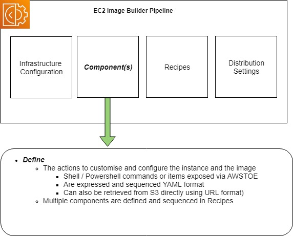

Over the last few weeks I've been evaluating Image Builder service as a replacement for a clients current Image Baking solution within their environment.

Their current tooling leverages a set of AWS serverless build technologies such as Lambda and Codebuild that focus on running Hashicorp Packer. Although this works well enough, it needed quite a bit of ongoing maintenance and we had a preference to explore a native service where we could focus on the use of the capability, and have the cloud provider handle the ongoing maintenance of it.

This blog post will walk you through the foundational components of the Image Builder service so you can understand it in a couple of minutes.

I'll be focusing on the production of AMI's and not touching the Container Image capabilities of the service, and it assumes that you already have all the services requirements in place inside your AWS environment such as VPCs, etc in which the service will need to function.

# What is EC2 Image Builder ?

Within AWS environments that leverage EC2, there is often a need for users to 'bake' AMI's in their accounts and then use these to launch EC2 instances via Cloudformation or Terraform.

Baking, in this context is the following process
* Take an AMI Image you have access to (Such as Windows or Linux)
* Launch an Instance from it
* Customise the settings on the Instance to meet your requirements
* Shutdown the Instance 
* Create a new AMI from that Instance that contains the original content + any customisations you might have made

The customisations a user might look to make includes adding their applications and other software to support it so that when the instance is launched from the new AMI the application immediately comes into service without the need to do them on initial launch from a vanilla AMI which could take long periods of time or have external dependancies.

This is where tools like Hashicorp Packer, or AWS EC2 Image builder come into play. They provide a capability to automate the baking process so that you have a consistent and repeatable outcome each time.

In the context of EC2 Image Builder, AWS desribes the service as follows:

_EC2 Image Builder simplifies the building, testing, and deployment of Virtual Machine and container images for use on AWS or on-premises._

_Image Builder is offered at no cost, other than the cost of the underlying AWS resources used to create, store, and share the images._

Within larger organisations, application teams would take the [SOE AMIs produced on a regular basis by their internal teams](https://notes.keiran.io/posts/Scaling_SOEs_in_AWS/) and customise them for their needs using the Image Builder service and then use the AMIs they produce to deploy EC2 instances in their accounts that run their applications.

# How does it work ? 

At the heart of the Image Builder service is the Pipeline. 

A Pipeline is created with a set of inputs, and when it is executed, the AWS service launches an EC2 Instance inside your account and orchestrates the customisation of the Instance and the production of an AMI Image from it.

One a Pipeline is defined, it can be executed in a number of ways such as via the AWS console, the CLI or other tools such as Terraform or CloudFormation.

One of the core features of Image Builder is that the service leverages service linked roles to run the automation in your account, so with the right IAM configuration the service can easily be integrated with other AWS services you might be using, such as S3, SSM , Secrets manager, KMS and more.

# What are the core components of the Service ? 

Image Builder pipelines are comprised of a number of other sub resources that must be defined. When you use the Image builder console the wizard will help you set these up,  

In the next few sections I'll run through each of them.

## Infrastructure Configuration

This defines the infrastructure within your account that the service will use to launch the Instance to be configured. This includes the VPC and Security Group configuration, the IAM Role that the instance will use, the tags assigned to it and more.

[Full size Diagram Image](img/Infrastructure.jpg)

##  Components
Components are blocks of commands and other actions that are defined to be run on the instance to customise (and optionally test it). 

The actions can be defined as scripting language actions in Shell or Powershell, or other items defined in the [AWSTOE component manager]( https://docs.aws.amazon.com/imagebuilder/latest/userguide/image-builder-action-modules.html). The AWSTOE includes common actions such as downloading files from S3 buckets or manipulating files on the host which you can call without having to develop them yourself.

A pipeline can contain multiple components (Currently up to 20), which are sequenced in Recipes

[Full size Diagram Image](img/Components.jpg)

## Recipes
Recipies pull in all the components you want and sequence their execution when the instance is launched, it also defines the Source AMI that will be used to launch the instance from as well as any block device settings you want to include.

[Full size Diagram Image](img/Recipes.jpg)

## Distribution Settings
Distribution settings define the configuration of the artefact Image Builder produces. 

Within distribution settings you define if you are producing an AMI or a Docker image, the naming format it will have, any tags you would like applied to it as well as any other accounts or regions you might optionally want to expose or copy the artefact to.

[Full size Diagram Image](img/Distribution.jpg)

## Pipelines

The last resource is the pipeline itself.

The pipeline pulls together all the sub resources you have defined already so that when it is executed it will produce an image that suits your needs.

Within the configuration , you can also set the execution of the pipeline on a schedule, or have it triggered on demand through the console or the Image Builders CLI or APIs.

[Full size Diagram Image](img/Pipeline.jpg)

## Running your Pipeline

Once you have a pipeline is defined, you can execute it which has the following things occur within your account.

This diagram uses a pipeline that creates an AMI as an example.

[Full size Diagram Image](img/Execution.jpg)

* The Image Builder service launches an instance in your account leveraging all the settings in your pipeline and sub-resources configuration
* The Recipes and Components are executed to customise the Instance for your needs and if they complete sucessfully, an AMI will be produced.
* Optionally - If testing is configured to occur in your pipeline, EC2 Image Builder service will launch another Instance in your account from your newly created AMI and execute any test cases that have been defined in your Pipelines Component definitions, increasing your confidence that your AMI is configured as you expect it.
* Once these tasks complete sucessfully, you will have an AMI ready for use in your account as per the configuration defined in your distribution settings

# Workflow
One thing that Image Builder currently has is a strong opinion on is its development workflow.

Pipelines can be defined using a mixture of pre-defined resources in the account (or optionally some exposed to you from other accounts via RAM Sharing), however be aware that defined components and recipes are immutable and you can't update them in place, having to introduce new versions of each, and then updating Recipes and Pipelines to reference specific versions of each accordingly to active their configuration in your build process.

Pipelines can be executed multiple times, and each produced Image is labelled with the version ID of the recipe and a timestamp allowing you to track AMI's back to the point in time version of the pipeline configuration that produced it.

[Full size Diagram Image](img/development_workflow.jpg)

# Orchestration implementation
When the Image Builder service launches the instance in your account to configure, it needs to be able to communicate with it to enable the components and recipes to be downloaded, executed and sequenced.

The Image Builder service does this via the AWS Systems Manager Service (aka SSM), and the only requirement it has for AMIs that are used with it, is that it has the SSM Agent installed and configured to start on launch, enabling host level communication to the service, however for certain operating systems, it will attempt to install the agent via Userdata if it is found to be absent.

This is a different approach to tools such as Packer which uses protocols such as WinRM or SSH to copy files and sequence actions (called provisioners) once it has launched the Instance to configure.

# Other things of interest

When working with Image Builder, you might find the following other items of use

## Infrastructure as Code Support

Image Builder has extensive Terraform and Cloudformation support, and pipelines can be easily and repeatably defined as code alongside your other AWS resources.

### Cloudformation

* [AWS::ImageBuilder::Component](https://docs.aws.amazon.com/AWSCloudFormation/latest/UserGuide/aws-resource-imagebuilder-component.html)
* [AWS::ImageBuilder::ContainerRecipe](https://docs.aws.amazon.com/AWSCloudFormation/latest/UserGuide/aws-resource-imagebuilder-containerrecipe.html)
* [AWS::ImageBuilder::DistributionConfiguration](https://docs.aws.amazon.com/AWSCloudFormation/latest/UserGuide/aws-resource-imagebuilder-distributionconfiguration.html)
* [AWS::ImageBuilder::Image](https://docs.aws.amazon.com/AWSCloudFormation/latest/UserGuide/aws-resource-imagebuilder-image.html)
* [AWS::ImageBuilder::ImagePipeline](https://docs.aws.amazon.com/AWSCloudFormation/latest/UserGuide/aws-resource-imagebuilder-imagepipeline.html)
* [AWS::ImageBuilder::ImageRecipe](https://docs.aws.amazon.com/AWSCloudFormation/latest/UserGuide/aws-resource-imagebuilder-imagerecipe.html)
* [AWS::ImageBuilder::InfrastructureConfiguration](https://docs.aws.amazon.com/AWSCloudFormation/latest/UserGuide/aws-resource-imagebuilder-infrastructureconfiguration.html)

### Terraform

* [imagebuilder_distribution_configuration](https://registry.terraform.io/providers/hashicorp/aws/latest/docs/resources/imagebuilder_distribution_configuration)
* [imagebuilder_component](https://registry.terraform.io/providers/hashicorp/aws/latest/docs/resources/imagebuilder_component)
* [imagebuilder_image_pipeline](https://registry.terraform.io/providers/hashicorp/aws/latest/docs/resources/imagebuilder_image_pipeline)
* [imagebuilder_image_recipe](https://registry.terraform.io/providers/hashicorp/aws/latest/docs/resources/imagebuilder_image_recipe)
* [imagebuilder_infrastructure_configuration](https://registry.terraform.io/providers/hashicorp/aws/latest/docs/resources/imagebuilder_infrastructure_configuration)
* [imagebuilder_image](https://registry.terraform.io/providers/hashicorp/aws/latest/docs/resources/imagebuilder_image)

## Security Considerations

When working with Image Bulder in security concious environments, you will be happy to know that the service leverages
* Service Linked roles with well defined IAM policies to ensure that it only has enough access into your account to do it's job
* Supports VPC endpoints so that it does not require service related traffic to egress your environment to function
* Supports KMS encryption for its resources to ensure that they are protected from unauthorised access
* Natively Logs to Cloudtrail, S3 and Cloudwatch to ensure that actions inside your environment can be audited and debugged
* Can be easily intergrated into other services within your environment through the configuration of the IAM role the instances uses on launch (See the Infrastructure configuration)
* Because the Image Builder service uses Systems Manager to communicate to the instance, there is no requirement for SSH or WinRM to be enabled or exposed for use in the solution unless you have some specific reason to introduce it. As a result, you are likely have a more secure configuration out of the box. 

You now know enough about EC2 Image Builder to be dangerous :)

