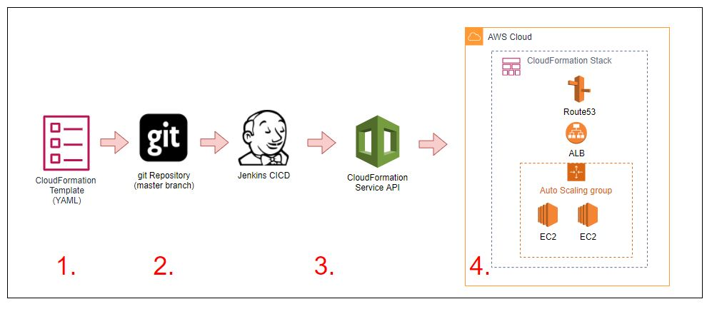
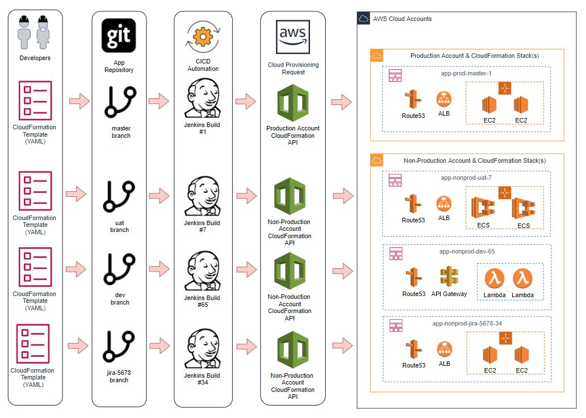

# Introduction
AWS provides many ways to deploy your applications to its vast ranges of services using an infrastructure as code approach.

There isn't always a "best practice" that suits every single service, application workload, developer workflow or tool, however there are some well oiled approaches that have served my collegues and I well over the years, one of which is the "Branch based build" pattern.

In this blog post, I thought I'd strip this back to basics and walk through the pattern, demonstrating it's objectives and capabilities as it's something I have taught customers and collegues alike in the past, but never wrote down.

_Note: In these, we will be working with AWS CloudFormation, however, this can be implemented with any tool of your choice from the AWS CLI to Hashicorp Terraform._

# From Code to Cloud

When cloud engineers use an Infrastruture as code approach for resource provisioning, it is best practice to store this code in a version control system such as git to track its history as you would for any other system or software product.

An added bonus of doing this, is that when combined with further automation such as a CICD tool the code in the git repository can be used to automatically deploy the cloud resources required to run your application.

In the Image below, we demonstrate a set of simple steps in which:

1. A CloudFormation template is created that contains:
    * 2 x EC2 Instances in an Autoscale Group
    * An Elastic Load Balancer distributing traffic to the instances
    * A Route53 DNS Record that points to the Load Balancer

2. CloudFormation templates are stored in the master branch of a git repository

3. A Jenkins CICD Job is associated with the master branch of the repository and when changes are pushed or merged to it, it submits the template to the AWS CloudFormation API

4. The CloudFormation service will either create a new CloudFormation stack and then provision the resources, or update an existing stack with the changes that have been made to the template in place.

When changes need to be made to the cloud resources, the code can be commited to the repository in which the Jenkins job will then trigger a CloudFormation stack update to update and your resources.




# Challenges and the transition to "Immutable infrastructure"

This deploy and update model lends itself well to core infrastructure that have low rates of change, however when it comes to applications, we often find that this can introduce problems as rolling back complex application changes, or testing them prior to deployment can be difficult.

As a result, the concept of immutable application deployments arose.

With immutable deployments, the objective is to never upgrade in place a deployed application and it's supporting infrastructure, but rather leverage the cloud providers vast resources in conjunction with further automation to provide us the ability to deploy entire  copies of the application stack with your changes in place in which you can transition your users to after testing.

Through leveraging this pattern, in the event a problem is found on new versions, you can easily return the users back to the original copy of the application and it's supporting infrastructure if/when required as it will be running in paralell until you are confident enough that it can be discarded ([this is commonly known as blue/green deployment](https://www.redhat.com/en/topics/devops/what-is-blue-green-deployment)), in addition to this, it also opens the door to new development workflows in which developers can develop and deploy an entire application stack that not just includes the application itself, but the entire supporting infrastructure of virtual machines, operating system configuration, scaling policies, monitoring settings and more.

If you would like to know a little bit more about the concept of immutable infrastructure, I encourage you to check out some of the blog posts and videos below.

* [Hashicorp - What is mutable vs immutable infrastructure ?](https://www.hashicorp.com/resources/what-is-mutable-vs-immutable-infrastructure/)
* [Digital Ocean - What is immutable infrastructure ?](https://www.digitalocean.com/community/tutorials/what-is-immutable-infrastructure)


# Enhancing the development flow

So, How can we enhance the development flow to implement this based on the above example ? 

This is where the the concept of "Branch based builds" comes into play, in this model, we continue to store all of our code in git, however we configure our CICD tool, in this case Jenkins to take a set of actions whenever a new branch is created and pushed to the repository to provision a unique set of defined resources based on the code in that particular branch.

To make things even better, when the branch is deleted, you could also look to implement the destruction of any provisioned resources associated with that branch that are no longer required.

The image below visualises this workflow, each branch of the application repository has deployed different variations of cloud resources based on the Cloudformation Template contained within it.





So what do we need to do first to acheive this pattern ?

## Parameterising your template
The first thing we need to do is to introduce some new parameters into our CloudFormation Template.

Parameters enable you to input custom values to your template each time you create or update a stack.

In this case, we will be introducing the following
* App
  * The application name prefix for our deployment.

    In our example, we will call this 'app'. In real world examples this would be something descriptive of the application being run, such as squid, web, bastion, etc

* Branch
  * This parameter represents the branch of the repository containing the template

* Build
  * This parameter represents the build number from your CICD tool

* Environment
  * This parameter represents the environment or service tier the deployment is being done in.
  
    This varies between organisations, however values such as prod, nonp, uat, dev are common. In this example we will use nonp for "Non-Production"

## Adjusting your resource names

When provisioning resources in your AWS account it is a good practice to define and adhere to a resource naming standard. Using the above Parameters, we will create all resources with the following naming convention.

```
<app>-<environment>-<branch>-<build>
```

In doing this;

* It prevents situations where resources conflict with the same name preventing creation, such as trying to create a load balancer, DNS record or SQS Queue with the same name
* It helps when navigating through your resources in the console or via CLI output as things will be clean and consistent, making filtering easy
* It allows you identify the source of the resource creation to a particular git repository branch or CICD Job

In the below code, I demonstrate how this has been implemented for a Load Balancer and corrosponding Route53 DNS Record.

```yaml
AWSTemplateFormatVersion: '2010-09-09'

Description: Example CFN Template example snippet

Parameters:

  Branch:
    Type: String
    Default: master
    Description: The value of the Branch for resources

  Build:
    Type: String
    Default: 1
    Description: The value of the Build for resources

  App:
    Type: String
    Default: app
    Description: The application prefix for resources

  Environment:
    Type: String
    Description: The Deployment environment
    Default: nonp
    AllowedValues:
      - prod
      - nonp
      - dev
    ConstraintDescription: Must be one of 'prod, nonp, or dev'


Resources:

  # Create an ELB with the ${App}-${Environment}-${Branch}-${Build}
  # name 

  InternalELB:
    Type: AWS::ElasticLoadBalancing::LoadBalancer
    Properties:
      LoadBalancerName:
        !Join
          - "-"
          - - !Ref App
            - !Ref Environment
            - !Ref Branch
            - !Ref Build
      Instances: 
        - !Ref InstanceA
        - !Ref InstanceB
      HealthCheck:
        HealthyThreshold: 3
        Interval: 6
        Target: TCP:443
        Timeout: 5
        UnhealthyThreshold: 4
      Listeners:
        - InstancePort: 443
          InstanceProtocol: TCP
          LoadBalancerPort: 443
          Protocol: TCP
      Tags: 
        - Key: App
          Value: !Ref App
        - Key: Environment
          Value: !Ref Environment
        - Key: Branch
          Value: !Ref Branch
        - Key: Build
          Value: !Ref Build

  #
  # Create a ${App}-${Environment}-${Branch}-${Build}.domain.example.com
  # DNS record for our load balancer deployments load balancer
  #

  InternalELBDnsRecord:
    Type: AWS::Route53::RecordSet
    Properties:
      Name: 
        Fn::Join:
          - '.'
          - - !Sub "${App}-${Environment}-${Branch}-${Build}"
            - "domain.example.com."
      HostedZoneId: !Ref PublicHostedZoneId
      ResourceRecords:
        - "Fn::GetAtt": [ InternalELB, DNSName ]
      Type: CNAME
      TTL: 60
```


_Note:  Be aware that each AWS Service has differing naming standards and boundaries, as such you may need to adjust this naming convention slightly to suit it, such as replacing dashes with underscores, etc_


## Update your tags
As you can see in the template, I also opted to assign tag values to the resources that match the parameters we pass in.

In doing this we can more effectively track resources in the account as well as get metrics such as how much cloud resources a particular feature branch cost from your detailed billing metrics reports.

You can find more out about this functionality below
* [AWS Billing and Cost Management - Using Cost Allocation Tags](https://docs.aws.amazon.com/awsaccountbilling/latest/aboutv2/cost-alloc-tags.html)

## Define a Stack Name Convention
The final step before moving onto the CICD component is defining a CloudFormation Stack name format.

Standardising the stack name format will allow us to ensure that there is no name collisions at the CloudFormation deployment layer and keeping them consistent with resource names means we can easily map created resources back to stacks as well as programatically discover and destroy them if/when required.

In this example, we will follow the resource naming convention, and create stacks with the following standard

```
<app>-<environment>-<branch>-<build>
```

## Tying it together with CICD

Once your template has been updated, we can start on the automation of the deployment itself using a CICD Tool, in this case, we will use the ever popular Jenkins.

The installation and configuration of the Jenkins server is out of scope, however the following steps need to be completed and I suggest reading the [Getting Started Guide first](https://www.jenkins.io/doc/book/pipeline/getting-started/)

1. Install the Jenkins Software
2. Ensure that the [AWS Steps Plugin is installed](https://github.com/jenkinsci/pipeline-aws-plugin)
3. Create a new Jenkins "Multi-Branch Pipeline" job and associate the Git Repostory that contains your Templates
4. Store a set of [AWS IAM Credentials in the Jenkins credentials store](https://support.cloudbees.com/hc/en-us/articles/360027893492-How-To-Authenticate-to-AWS-with-the-Pipeline-AWS-Plugin) that can be retreived from the Jenkins pipelines steps, in this case, they are stored in a value called ```AWSDemoCredentials```

When this is done, we now introduce a Jenkinsfile into our repository that contains steps to deploy our CloudFormation template whenever this branch is pushed.

A sample [Jenkinsfile](https://www.jenkins.io/doc/book/pipeline/jenkinsfile/) is provided below that defines a set of stages that will execute when the branch is pushed to the repository, these are:

1. Validate template syntax
    * Check the Validity of the template.yaml file in the repository

2. Using the AWS Steps plugin functions
    * Retreive the AWS Credentials from the store
    * Create a new CloudFormation stack using our naming convention of ```<app>-<environment>-<branch>-<build>``` that uses a combination of the contents of the template file and the relevant Environment, Branch and Build ID as template parameters.

      These parameters will flow through the template, influencing the names of the resources being created and the tags on them.

3. Once completed, the job will pause waiting for user confirmation to delete the stack when you have finished with it.


  ```Groovy
  pipeline {
      agent any

      environment {
          ENVIRONMENT = 'nonp'
      }
      stages {
          stage('Validate Template') {
              steps {
                  withAWS(region:'ap-southeast-2',credentials:'AWSDemoCredentials') {
                      cfnValidate(file: 'template.yaml')
                  }
              }
          }
          stage('Create Stack') {
              steps {
                  withAWS(region:'ap-southeast-2',credentials:'AWSDemoCredentials') {
                      cfnUpdate(file: 'template.yaml', stack:"app-${ENVIRONMENT}-${GIT_BRANCH}-${BUILD_ID}",params:["app=app,Environment=${ENVIRONMENT},Branch=${GIT_BRANCH},Build=${BUILD_ID}"] ,pollInterval:1000)
                  }
              }
          }
          stage('Delete Stack') {
              input { 
                  message "Are you done with this build - Should we delete the CFN Stack ?"
                  ok "Yes, We should"
              }
              steps {
                  withAWS(region:'ap-southeast-2',credentials:'AWSDemoCredentials') {
                      cfnDelete(stack:"app-${ENVIRONMENT}-${GIT_BRANCH}-${BUILD_ID}" , pollInterval:1000)
                  }
              }
          }
      }
  }
  ```


And there you have it, a quick branch based build solution with minimal changes to your code !

## Final thoughts

The branch based build pattern provides a easy stepping stone into automation with AWS and is well suited for stateless applications on EC2 that are frontend with load balancers such as squid proxies, however with greater automation and orchestration, in conjunction with snapshots, it can be effective for stateful workloads that leverage EBS volumes and RDS databases as well.

However, do keep in mind that some services don't lend themselves well to this approach for release management, providing their own preferred build and deployment workflows, and it is important to research and evaluate these in when implementing your solutions.


