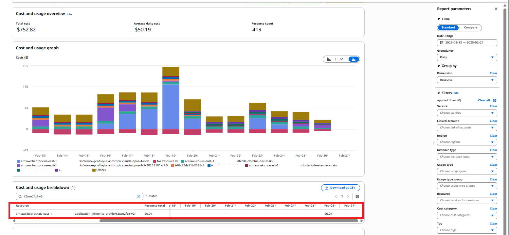
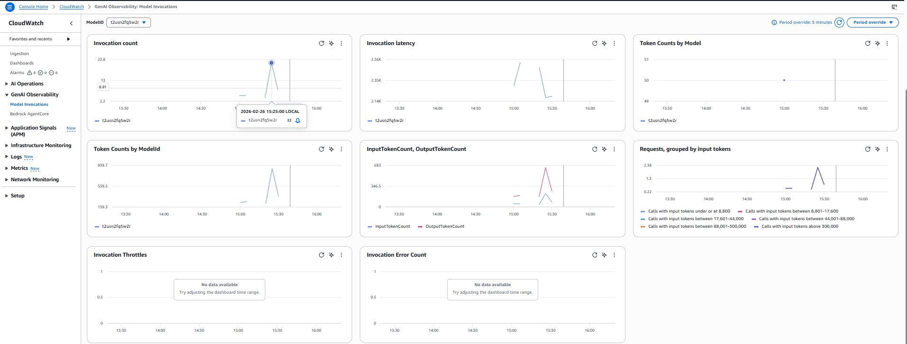
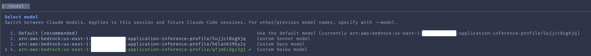

## Introduction & Problem Space

As organisations expand their use of AI‑driven engineering workflows, managing and optimising model‑related cloud consumption becomes essential.
 

Our Agentic Tasks Platform, built on the [Coder.com technology stack](www.coder.com), streamlines these AI agent workflows by allowing us to easily assign engineering and operational tasks from issue‑tracking systems such as GitHub Projects or JIRA into isolated, containerised runtime environments where an AI Agent can commence work activities.


In this way, users can have multiple specialised agents working on a variety of tasks in parallel, on dedicated, ephemeral infrastructure, without tying up their workstation resources or requiring execution in locations far from the systems they need to work with.

Each task runtime environment, when launched, contains the tools, integrations, and context required for an AI agent-such as Kiro, GitHub Copilot, or Anthropic Claude - to execute tasks end‑to‑end, or, depending on the task, to a point where we want a human to complete a final review before release.


In the configuration discussed in this post, we will talk about how our use of Claude Code in this manner to perform a wide variety of activities resulted in an increasingly expensive consumption profile within Amazon Bedrock as task volumes grew, and the changes we made to the architecture to gain more agent observability, user accountability, performance, and financial control - without negatively impacting the availability or capabilities of the Claude functionality we rely on today.


These changes, although discussed in the context of our Tasks Platform and Coder.com, can be applied to a variety of technical use cases when working with Bedrock‑hosted LLMs.
 

## Current Architecture

Within the current platform architecture, the Claude agent is installed inside each runtime environment. The agent requires access to the underlying Anthropic Claude models that provide its reasoning and coding capabilities. This access can be configured in two primary ways:

 

**Direct Anthropic API**

Using an Anthropic API key, the runtime calls Claude through Anthropic’s hosted API. Billing is handled through a separate Anthropic subscription.

 

**Claude via Amazon Bedrock**

The agent is configured to use a Claude model hosted by Amazon Bedrock. In this setup, all usage appears on the AWS bill, and there is no need for a separate Anthropic subscription. This centralises governance, cost management, and broader cloud‑native controls within AWS.
 

In the Bedrock configuration, access is typically granted through a Bedrock API key or a suitably assigned IAM role to the task runtime itself. Once suitable access is enabled, the runtime is configured to use Bedrock models by setting environment variables before the Claude agent starts:


```bash
# Enable Bedrock integration
export CLAUDE_CODE_USE_BEDROCK=1
export AWS_REGION=us-east-1  # or your preferred region
```

With these variables set, Claude automatically switches to invoking Bedrock‑hosted models instead of Anthropic’s direct API, making the integration seamless and cloud‑native.


## Challenges with the Current Configuration

While routing Claude through Amazon Bedrock simplifies integration and consolidates billing, through ongoing use we also encountered several challenges that become more significant as usage scales.
 

## Model Selection Patterns

One issue is model choice. Our AWS billing shows that Claude Opus - the most advanced (and most expensive) model - is heavily used. This is expected due to its capability, but not ideal. Opus is designed for the hardest reasoning problems, yet it is frequently used for routine engineering tasks that don’t require its depth. 

We want teams to have access to the full model suite - Opus, Sonnet, and Haiku - but also to understand when each model is appropriate.


## Lack of Cost Attribution

Although AWS Cost and Usage Reports (CUR) show how much each model costs, in our current implementation they do not show:
 

* Which team used the model
* Why the invocation occurred
* What the cost of those specific invocations was
* Specific details and trends related to token usage during inference activities
 
This lack of specific information makes it difficult to drive cost‑aware behaviours and even harder to forecast usage as adoption grows. As more teams adopt the platform, this becomes a meaningful governance and financial planning gap.
 

These challenges form the basis for why better education, cost controls, and attribution mechanisms are needed.


## Token and Context Efficiency

In Amazon Bedrock, like many other AI and LLM tools, tokens directly determine cost. Every prompt and model response is broken into tokens, and Bedrock bills separately for input and output tokens based on each model’s pricing tier.


Because different models (like Claude, Titan, and Cohere) use different tokenizers, the same text can generate different token counts - and therefore different costs. The principle is simple: more tokens or a more expensive model equals higher spend.


This becomes especially important in our platform, where every task runtime is injected with rich context-configuration, MCP servers, dependency information, and other metadata - to ensure the agent can perform the full scope of actions we expect. 

While this context is essential for correct behaviour, it also increases the size of every input prompt, which directly increases token usage and cost. Combined with longer prompts, larger context windows, and high‑end models like Opus, token volume becomes a major optimisation area - making both model selection and prompt efficiency critical for cost control.

 

## Addressing the Issues

In the next sections, we’ll run through the changes we made to the solution and capabilities and made them available to our users.

 

## Educating Teams: Choosing the Right Model for the Right Task

Our first optimization step is educational - helping teams understand the differences between Claude models and guiding them to select the most cost‑appropriate one for their task.

 

Below is a simplified reference cost table using Bedrock pricing for us‑east‑1 (Feb 2026):

 

### Bedrock Model Pricing (North Virginia)

| Model | Input Cost (per 1M tokens) | Output Cost (per 1M tokens) | Best For |
|-------|---------------------------|-----------------------------|----------|
| Claude Opus 4.6 | $5.00 | $25.00 | Most complex reasoning, deep analysis, advanced coding, high‑stakes use cases |
| Claude Sonnet 4.5 | $3.00 | $15.00 | Strong reasoning, ideal for production engineering tasks, balanced cost/performance |
| Claude Haiku 4.5 | $1.00 | $5.00 | Fastest and cheapest; best for lightweight tasks or high‑volume workloads |


 

We also provide high‑level practical guidance, while pointing teams to the model documentation for deeper optimisation:
 

* **Opus** – Use only when maximum intelligence is essential. Ideal for deep architecture analysis, complex refactoring, or high‑risk engineering work.

* **Sonnet** – The best default choice for most engineering tasks. Strong performance and materially cheaper than Opus.

* **Haiku** – Excellent for classification, summarisation, quick transformations, and other low‑complexity tasks.
 

This educational step alone often reduces overuse of Opus and delivers immediate cost savings before we even apply automation or attribution improvements.

 

## Supporting Better Defaults in Autonomous Tasks

To further help users make good model choices - especially when tasks are triggered autonomously - we introduced template parameters that allow each task type to specify its preferred model.
 

By default, tasks now use Haiku, which ensures that lightweight or high‑volume workflows incur the lowest cost possible. However, users can override this by selecting Sonnet or Opus when a more capable model is genuinely required.
 

This approach provides:

* Cost‑safe defaults
* Flexibility for advanced tasks
* An “element of least surprise” when invoking new tasks
 
In other words, teams only pay Opus‑level prices when they explicitly choose Opus‑level intelligence.
 

## Implementing Cost & Invocation Attribution with Bedrock Inference Profiles

To address our attribution and governance challenges, we’ve adopted Amazon Bedrock Inference Profiles as the standard entry point for all Claude model usage. 

An inference profile acts as a managed, named configuration layer between our platform and the underlying foundation model, allowing us to centralise routing, enforce consistent settings, and take advantage of cross‑Region inference for availability and performance.Instead of having applications call raw model ARNs, we point them to a profile ARN - giving us a stable, controlled interface while Bedrock handles routing and capacity management behind the scenes.

More importantly, inference profiles solve the core problem of cost and usage attribution. By creating application‑level inference profiles for each team, organisation, or task type, we can assign cost‑allocation tags that surface cleanly in AWS billing and CloudWatch metrics.


Pairing this with IAM policies scoped to the profile ARN - rather than directly to a model - ensures that all invocations go through these tagged, governed profiles.
 

This unlocks accurate chargeback, enforces the use of approved configurations, and guarantees that every Claude invocation can be traced to an owner and a purpose, eliminating the “who used Opus and why?” ambiguity we currently face.
 

## Creating an Inference Profile for a Specific Claude Model

To use Bedrock Inference Profiles for cost attribution and governance, we first need to create a profile for the specific Claude model we want to route traffic through. Although the Bedrock console shows all system‑defined profiles, you must use the AWS CLI, API, or IaC tooling to create, inspect, and manage your own application inference profiles - they don’t appear in the console.

The first step is identifying the system‑defined profile for the model you want to base yours on. In our case, we’re using Claude Opus 4.6, so we list available profiles and filter by name:

 

```bash
aws bedrock list-inference-profiles --type-equals SYSTEM_DEFINED | 
  grep claude | grep -i opus | grep 4.6 | grep inferenceProfileArn
```

This returns the system profiles we can copy:
```
"inferenceProfileArn": "arn:aws:bedrock:us-east-1:0123456789:inference-profile/global.anthropic.claude-opus-4-6-v1",
"inferenceProfileArn": "arn:aws:bedrock:us-east-1:0123456789:inference-profile/us.anthropic.claude-opus-4-6-v1"
```

We then create our own application inference profile based on the U.S. regional version:


```bash
aws bedrock create-inference-profile 
  --inference-profile-name "cde-dev-opus46-us-main" 
  --model-source "copyFrom=arn:aws:bedrock:us-east-1:0123456789:inference-profile/us.anthropic.claude-opus-4-6-v1" 
  --description "US Opus 4.6 Profile for cde-dev-opus46-us-main"
```

Bedrock returns an ARN confirming the new profile:

```
"inferenceProfileArn": "arn:aws:bedrock:us-east-1:0123456789:application-inference-profile/t2usn2fq5w2r",
"status": "ACTIVE"
```

Next, we retrieve the full configuration to verify which model ARNs and Regions the new profile covers:


```bash
aws bedrock get-inference-profile 
  --inference-profile-identifier arn:aws:bedrock:us-east-1:0123456789:application-inference-profile/t2usn2fq5w2r
```

This shows our profile name, status, Regions, and the linked Claude Opus foundation models.

 
## Tagging the Profile for Cost Attribution

To enable team‑level cost tracking and governance, we tag the profile with meaningful metadata such as environment, model, geographic routing, and internal identifiers:

 

```bash
aws bedrock tag-resource \
  --resource-arn arn:aws:bedrock:us-east-1:0123456789:application-inference-profile/t2usn2fq5w2r \
  --tags \
    key=Appname,value=CDE \
    key=Environment,value=Dev \
    key=LLM,value=Anthropic \
    key=Model,value=Opus \
    key=ModelVersion,value=4.6 \
    key=Geo,value=US \
    key=component_name,value=tasks \
    key=identifier,value=main
```

You can confirm that the profile now carries the correct tagging:

```bash
aws bedrock list-tags-for-resource 
  --resource-arn arn:aws:bedrock:us-east-1:0123456789:application-inference-profile/t2usn2fq5w2r
```
 

## Validating the Profile

To verify the profile is functional, we invoke the model through the new profile’s ARN:


```bash
aws bedrock-runtime invoke-model 
  --model-id arn:aws:bedrock:us-east-1:0123456789:application-inference-profile/t2usn2fq5w2r 
  --body fileb://<(echo '{"anthropic_version":"bedrock-2023-05-31","max_tokens":100,"messages":[{"role":"user","content":"Hello, world"}]}') 
  --content-type application/json 
  --accept application/json 
  output.json
```

The response confirms that Claude Opus 4.6 was invoked correctly through our application inference profile, returning a standard assistant message and usage metrics.
 

## Profile‑Specific Cost Accounting

With inference profiles now fully integrated into the AWS Cost Calculator, we can directly view costs broken down at the profile level rather than only at the underlying model layer. This means each profile - representing a team, workflow, or autonomous agent - exposes its own consumption footprint, giving us granular visibility into how inference activities translate into actual spend. By isolating the cost of individual profiles, we can more accurately attribute usage, validate optimizations, and forecast expenses with far greater precision, ensuring every workload is both transparent and financially accountable.

 

In the screenshot below, you can see this in the cost calculator for this profile.

 


 [Open image in browser](img/costs.png)

 

 

 

 

 

## Profile‑Specific Observations and Metrics

Another significant benefit of this approach is the availability of profile‑specific observations and metrics, which become accessible as soon as your application inference profile is created and active. Because inference profiles serve as logical model identifiers, Amazon Bedrock automatically emits usage and performance metrics scoped to the profile rather than only to the underlying foundation model, giving you granular visibility into requests routed through that profile-visibility that isn’t possible when calling models directly.

By selecting the inference profile in CloudWatch, you can view metrics such as request counts, token usage, latency, and error rates tied to the profile’s ARN, allowing you to isolate usage for specific teams, environments, or autonomous task flows. While our demonstration environment shows only minimal data, in real high‑volume deployments these metrics become invaluable for understanding consumption patterns, detecting anomalies, validating cost‑saving changes, and supporting more targeted FinOps practices.

 

In the screenshot below, you can see the metrics available for this profile; the patchy graphs are due to the limited data in this example.

 


[Open image in browser](img/cloudwatch.png)
 

 

 

## Configuring Claude to Leverage Inference Profiles

Now that you’ve created inference profiles for the models you need, the next step is to configure your Claude code so requests are routed through those profiles.

 

The simplest way is to set model‑specific environment variables that point to your inference profile ARNs (as documented by Claude/Anthropic). This “pins” each model family (Opus, Sonnet, Haiku) to the correct profile, ensuring your usage, metrics, and costs are tracked at the profile level.

 

Here is a sample below

 

```
# Profile-qualified model identifiers (from your screenshot)

export ANTHROPIC_DEFAULT_SONNET_MODEL='arn:aws:bedrock:us-east-1:0123456789:application-inference-profile/5ujjct8xghjq'
export ANTHROPIC_DEFAULT_OPUS_MODEL='arn:aws:bedrock:us-east-1:0123456789:application-inference-profile/h6lank596y2y'
export ANTHROPIC_DEFAULT_HAIKU_MODEL='arn:aws:bedrock:us-east-1:0123456789:application-inference-profile/qfjm6idgv3g1'
```

And from within Claude, you can see that these models are now configured using the profiles itself.

 


[Open image in browser](img/claude-cli.png)
 

 

 

## A Note on Authentication and API Keys

To ensure your inference profiles are always used-and to prevent applications from invoking models directly-it’s important to configure IAM permissions correctly. When Bedrock API keys are created, AWS automatically provisions an IAM user with a broad Bedrock policy, which is often far more permissive than needed. These policies, whether attached to the API key’s IAM user or to the IAM role your application uses, should be reviewed and tightened.


Limit permissions so the application can invoke only the specific inference profile ARNs, and remove unnecessary access to the underlying models. Applying least‑privilege IAM controls ensures requests go through the intended profiles, giving you predictable usage, proper cost attribution, and stronger governance.

 

The configuration of these policies are detailed in the AWS Documentation here: [Prerequisites for inference profiles - Amazon Bedrock](https://docs.aws.amazon.com/bedrock/latest/userguide/inference-profiles-prereq.html)


## Claude Context and Token Optimisations

When we first began integrating AI tools - Claude included - our goal was to make them behave as closely as possible to a real team member. To support this, we converted our Architecture Decision Records (ADRs) into AI‑friendly formats such as Kiro Rules and claude.md. These ADRs define how we work: coding standards, branching and commit practices, PR review expectations, testing patterns, and more.

Our early approach involved injecting all these encoded standards into the agent’s runtime from a central Git repository. This worked initially, but over time the configuration files grew substantially. They started consuming a large portion of the model’s context window and significantly increased token usage, especially once the agents were integrated with multiple Model Context Protocol (MCP) services. The combination resulted in inflated costs and unnecessary cognitive burden on the model.

To address this, we’ve begun a series of optimisation efforts in our environment:

**Simplify rules wherever possible**

We’re using AI to help condense and clarify our standards. The focus is on short, pointed rules that remain traceable back to the original ADRs so governance and auditability are preserved.

**Transition standards to the Skills format**

Instead of loading everything into the active context window, Skills act as a modular library of capabilities that can be loaded dynamically only when needed. This keeps the working context small, reduces token usage, and ensures the agent only pulls in the relevant knowledge for the task at hand.

An added benefit of moving to Skills is vendor alignment. Skills are now ratified as an open standard alongside MCP and are being adopted broadly by multiple agent ecosystems, including vendors such as Kiro, Copilot, and others. This reduces the overhead of maintaining bespoke configuration files and formats between tools, and allows Skills to be portable across vendors-greatly simplifying multi‑tool AI environments.

The resources below are highly recommended if you’re starting the transition to Skills or wanting to deepen your understanding:

* [Don't Build Agents, Build Skills Instead – Barry Zhang & Mahesh Murag, Anthropic](https://www.youtube.com/watch?v=CEvIs9y1uog)

* [Agent Skills Open Specification](https://agentskills.io/home)

* [Extend Claude with Skills](https://code.claude.com/docs/en/skills)


This concludes the walkthrough of our approach to optimising inference costs across the tasks platform. and I hope the techniques and patterns shared here are useful to anyone looking to apply similar improvements within their own applications or infrastructure.

This post was written with assistance from AI, and I’ve made sure all examples, configurations, and recommendations are technically accurate as of the time of writing. 