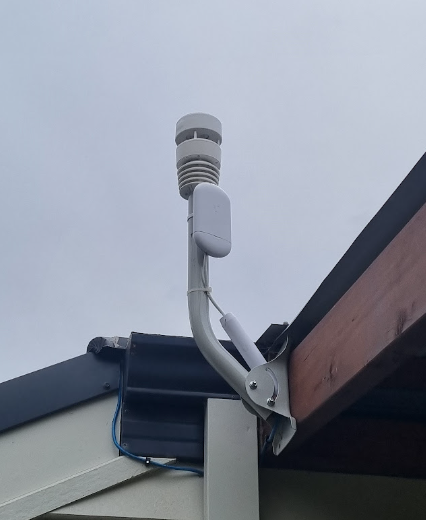

The AI agent ecosystem is moving at a frankly insane pace. We are rapidly transitioning from a period of building custom implementations with thousands of lines of code to an era of standardized, portable intelligence modules.

I’ve spent the last few weeks exploring this shift by building a network operations assistant for my home network. I have two **Ubiquiti PtP (Point-to-Point) devices** that provide connectivity from my house to my shed (See picture). Unlike more modern UniFi gear, these devices don't support the UniFi app for management. Instead, they expose their metrics through their own dedicated application or via SNMPv1, requiring you to bring your own tools and infrastructure you want any level of reliable observability.



As a learning exercise, I used this as an opportunity to build an AI agent that could communicate to these devices. I find that I learn best by understanding the foundations of a system before relying on abstractions; diving into the low-level mechanics of an agent helps me stay proficient across the entire technology stack. 

I started by building the agent the "hard way" using the [AWS Strands SDK](https://strandsagents.com/), and then re-implemented the same functionality using the emerging AI Agent Skill standards to see how they compared in the wild.

---

## AI SDK's : Power at the Cost of Complexity

To understand the "hard way," you first have to look at the various tools available for you to use. I opted for the  AWS Strands SDK,  a developer framework designed to simplify the creation of AI agents by providing all the tools necessary to connect Large Language Models (LLMs) to real-world (aka systems at my house) tools. While the name suggests an AWS-only ecosystem, Strands is actually provider-agnostic- supporting many of the most popular LLMs including Google (Gemini), Anthropic (Claude), and OpenAI alongside those hosted and served by AWS Bedrock. It sits in a category of powerful agentic toolchains like LangChain and Google ADK.

One of the core strengths of the Strands SDK is its native support for Python. Because of this, I was able to write an agent that leveraged the mature pysnmp library. This allowed me to handle the low-level complexities of SNMPv1- like OID resolution and packet parsing- directly within the agent's toolset to retrieve the values I needed from my Ubiquiti devices.

Building with an SDK like Strands represents the "High-Control" approach. It is extremely powerful, giving you total authority over the agent's reasoning loop, it's runtime environment and the behaviour of the tools it has available to it. However, that power comes with a significant implementation cost. 

In my `agent.py` prototype, I was the architect and the engineer of the entire stack. I had to manually manage the `asyncio` loop, handle the SNMP MIB resolution/compilation via Python, and register every tool. I wasn't just telling the agent what to do; I had to build every single component that allowed it to function.

```python
# From agent.py 
# Leveraging Python's pysnmp library within the tool definition
@tool
async def get_device_data_by_name(device_name):
    """Looks up a device by name and returns its SNMP data via pysnmp."""
    device = next((d for d in settings["devices"] if d["name"] == device_name), None)
    if not device:
        return {"error": f"Device '{device_name}' not found."}
    return await snmp_walk_to_json(device["ip"], device["community"])

agent = Agent(
    model=model,
    tools=[get_devices_inventory, get_device_data_by_name, get_device_samples],
    system_prompt=("You are a Senior Wireless Engineer...")
)

```

### Multi-Model Execution & Output

To test the robustness of the SDK approach, I ran the agent against four different models across Bedrock and Gemini. Each model navigated the SNMP toolset to produce a performance and reliability audit. You can view the raw outputs of these executions below to see how each interpreted the telemetry and provided me guidance on what to change.

* **[Claude 3.5 Sonnet (via Bedrock)](https://github.com/keirans/loco-engineer/blob/master/example-outputs.md):** 
* **[Claude 3 Haiku (via Bedrock)](https://github.com/keirans/loco-engineer/blob/master/example-outputs.md):** 
* **[Gemini 1.5 Pro (via Google)](https://github.com/keirans/loco-engineer/blob/master/example-outputs.md):** 
* **[Gemini 1.5 Flash (via Google)](https://github.com/keirans/loco-engineer/blob/master/example-outputs.md):** 

While the SDK makes switching models relatively straight forward, it isn't always set and forget. Differences in how models handle tool-calling schemas or system prompt adherence mean that a change in the model may require configuration or code adjustments to maintain the same quality of output. And although this provides deep customization, inevitably creates a software codebase linked to a specific SDK to maintain over time.

---

## The Arrival of the Portable Skill standard


The alternative is the "Skills" approach, which treats intelligence as a [declarative standard](https://agentskills.io/) rather than a software application. Instead of writing the *how* (the tools and the orchestration code on when to call them), you define the *what* (the capability) in a simple file called `SKILL.md`.

I took the logic I’d buried in 150+ lines of Python and refactored it into a sequence of instructions and scripts. The Intelligence moved from the Python code into a Markdown file and some complimentary bash:

1. **Inventory:** Run `get_devices_inventory.sh` to return the devices on my network and the required metadata to communicate with them over SNMP.
2. **Sampling:** Run `get_device_samples.sh` to pull live SNMP metrics from the devices using some linux CLI tools
3. **Guardrails:** Consult `guardrails.md` to compare the real-time data against optimal signal strength and CCQ targets.

### The Power of Bundled Executables

One of the major benefits of the Skills structure is the ability to bundle specialized scripts directly with the skill. Instead of writing generic wrappers in an SDK, you can include high-performance shell scripts, Python snippets, or even pre-compiled binaries that the skill can execute to perform specific, complex tasks- like my SNMP walk logic. This allows the skill to handle heavy lifting locally while using the LLM strictly for reasoning.

Beyond the ease of development, Skills provide significant architectural benefits regarding context and tokens:

* **Progressive Disclosure:** Instead of dumping every OID and MIB definition into a global system prompt, a Skill only exposes relevant documentation and tools when they are actually needed.
* **Token Efficiency:** By offloading logic to bundled scripts and providing concise guardrails, you drastically reduce the input tokens required for each turn. You aren't paying to "teach" the model SNMP every time; you're just paying for it effectively fetch the data and analyze the *results*.

### One Skill, Four Agents

This approach offers a significantly lower barrier to entry. You aren't building a software application; you are automating a task. Because the Skill is declarative and follows a standard, I was able to run the _exact same assets_ across a variety of commercial and open-source agents with identical outcomes.

In the screenshots linked below, you can see this portability in action. I executed the same SNMP link audit skill using:

* **[MS Copilot](./copilot.md)** (GPT-5-Mini Model)
* **[Amazon Kiro](./Kiro.md)** (Auto Routing to a selected Bedrock-backed model based on task)
* **[Google Gemini](./Gemini.md)** (Gemini 3 Model)
* **[OpenCode Agent](./OpenCode.md)** (Pickle model that is currently free)

Despite having completely different backing LLMs and development teams and paradigms, each agent was able to ingest the skill, execute the bundled scripts, and provide the same high-quality technical analysis. This is the power of skills: they enable you to move quickly for many tasks while removing the need for complex model or agent specific code.

---

## Portability Wins

By building the agent "from the ground up" first, I realized that most of the code I wrote for the SDK version was just "plumbing." When I switched to a Skill, I was able to shed a lot of code replacing it with simple scripts and command line tools that already existed within a modern Linux runtime.

* **Zero Boilerplate:** You stop writing `agent(message)` and start focusing on the "Intelligence Layer." The host agent already knows how to handle the reasoning loop and how to invoke tools and perform actions from where it is being executed.
* **Ecosystem Agility:** You aren't locked into a single vendor. If a new open-source model or agent platform emerges tomorrow, your Skill is ready to move.
* **Broad Adoption:** The ability to deploy your codified AI expertise anywhere has instant impact on scale.

### From Prototype to Production

In a real-world, non-prototype scenario, I wouldn't actually opt to have the agents talking directly to the end devices. Instead, I would integrate these devices into a suitable observability platform such as Splunk or Grafana. This platform would focus on the retrieval of data and storing it in a format optimized for queries, eventually exposing APIs or Model Context Protocol (MCP) endpoints for our Agent to use. The Agent could then use a specialized aligned set of Skills to then leverage these capabilities to perform the necessary analysis without the agent ever needing to handle raw SNMP or other low-level protocols.

A great example of this implementation is the [ha-mcp MCP and Skills project](https://github.com/homeassistant-ai/ha-mcp). In that project, they enable suitably configured agents to look at the event history of actions within an automated home using [Home Assistant](https://www.home-assistant.io/), detect patterns, and suggest automations based on observations- such as: *"You always turn on a light around 6pm; here is an automation to do this on a schedule for you."* By separating the data ingestion from the reasoning layer, the agent becomes significantly more reliable and efficient.

---

## Wrapping up: Intelligence, Not Infrastructure

The AWS Strands SDK is a powerful tool for building bespoke or custom AI products or solutions. However, for many automation tasks, the overhead of a large codebase can become a maintainence liability.

The move toward portable Skills allows us to build "Just-in-Time" expertise that remains environment-agnostic and ready for immediate deployment. While commercial off-the-shelf agents often try to keep you on a "straight and narrow" (and strictly commercial) path, tools like the [OpenCode Agent](https://opencode.ai/) provide significantly more flexibility from a configuration and integration perspective. By supporting open standards and even local models, these tools ensure your automation can remain as portable and customizable as the Skills themselves.

I’ve provided the [code for both the SDK implementation and the Portable Skill version here](https://github.com/keirans/loco-engineer) so you can see the shift in complexity for yourself.

_Now, Time for me to implement those PtP link recommendations !_

---

This post was written with assistance from AI, and I’ve worked to made sure all examples, configurations, and recommendations are technically accurate as of the time of writing.